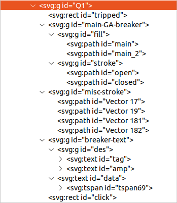

# @gapit/ga-component

This component handles GA drawings of SLD components.

This component is created based around the gaHandler function and requires all elements to be included. The element list will be listed below.

This component is used with Grafana specific to the plugin: [htmlgrapics](https://grafana.com/grafana/plugins/gapit-htmlgraphics-panel/).

---

## SVG Element

This is how a working ga element looks like. The code is sensitive to the given names so they should not be altered. To create more than one element at a time add a "\_number" to the end.




---

## customProperties

Here is the json needed for the function. The id is tied to the group name of the SVG component. The metric and metricVar's are connected to the alias given to the grafana query.

```json
{
  "isShowcase": true,
  "defaultColors": {
    "active": {
      "lightTheme": "#272729",
      "darkTheme": "#fff",
      "tripped": "#af2341",
      "missingCom": "#ffcd00"
    },
    "inactive": {
      "lightTheme": "#9F9F9F",
      "darkTheme": "#6D6F73"
    }
  },
  "components": {
    "Q1": {
      "id": "Q1",
      "idSuffix": "",
      "metric": "Q1",
      "metricVar": {
        "breakerMetric": "-breaker",
        "valueMetric": "-data",
        "trippedMetric": "-tripped"
      },
      "isActive": true,
      "link": "some url",
      "invertTripped": false,
      "invertBreaker": false,
      "baseUnit": "kW",
      "decimals": 1,
      "descriptionText": "2000A"
    }
  }
}
```

---

## onRender

This is how the main function should be handled. This will not make the elements clickable, however this can be done using basic click functions.

```ts
import { gaHandler } from "@gapit/ga-component";

const { isShowcase, components, defaultColors } = customProperties;

function runGA() {
  for (const component of Object.values(components))
    gaHandler({ component, defaultColors, showcase: isShowcase });
}

const initialize = () => {
  runGA();
};

initialize();
```


---

## getElementConfig

This is another useful function to further customize your elements.
Given the components id & idSuffix it will return each given element. Depending on what you do you can customize as you would like but, the base function may override it.

```ts
import { getElementConfig } from "@gapit/ga-component";

const { components } = customProperties;
const { id, idSuffix } = components;
for (const { id, idSuffix } of Object.values(components)) {
  const {
    groupElt,
    clickElt,
    valueElt,
    descriptionElt,
    textElt,
    trippedElt,
    strokeGroup,
    fillGroup,
    activeBreaker,
    inactiveBreaker,
  } = getElementConfig({ id, idSuffix });
}
```
